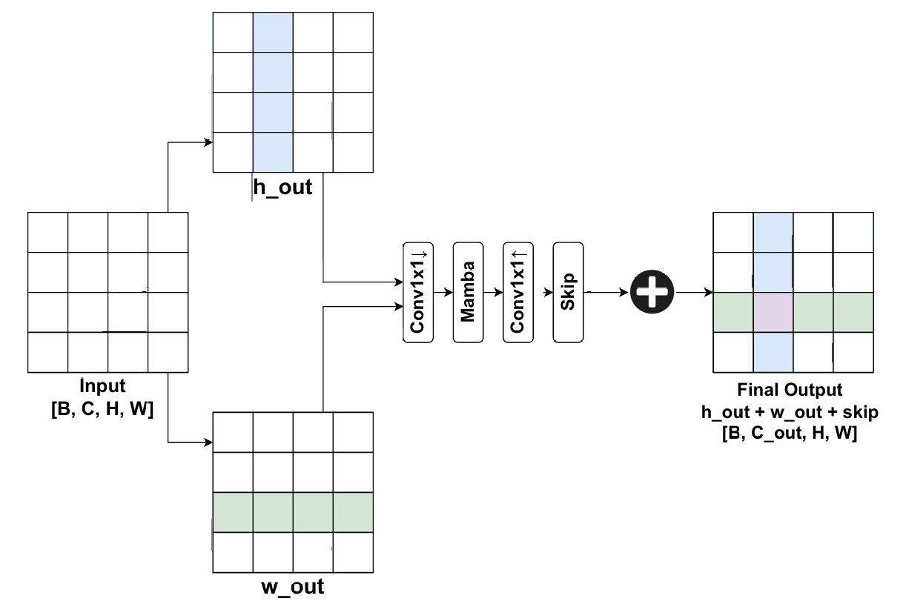
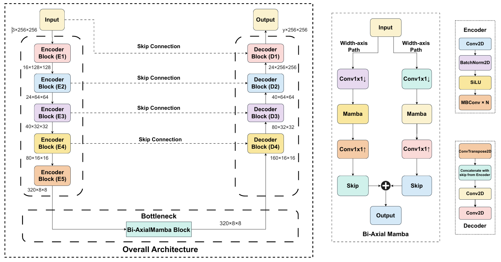

# \[🩺CVAMD @ ICCV2025🌺\] BAMPolyp: Bi-Axial Mamba Bottleneck for Gastrointestinal Polyp Segmentation


> **Official PyTorch implementation of the paper**  
> 📄 *BAMPolyp: Bi-Axial Mamba Bottleneck for Gastrointestinal Polyp Segmentation*  
> 🏆 Accepted at **[ICCV 2025](https://iccv.thecvf.com/), [CVAMD Workshop](https://cvamd.github.io/CVAMD2025/)**  
>  
> 📍 **Paper PDF (CVF Open Access):** [Click Here](https://openaccess.thecvf.com/content/ICCV2025W/CVAMD/html/Islam_BAMPolyp_Bi-Axial_Mamba_Bottleneck_for_Gastrointestinal_Polyp_Segmentation_ICCVW_2025_paper.html) <br />
> 🎴 **Poster:** [Click Here](https://github.com/farhad324/BAMPolyp/blob/main/poster/bampolyp.pdf)  <br />
> 👨🏻‍🔬 **Authors:** Md. Farhadul Islam, Tashik Ahmed, Partho Chanda, Joyanta J. Mondal, Meem Arafat Manab, Sarah Zabeen & Jannatun Noor
---


## 🧠 Overview

**BAMPolyp** is a lightweight yet powerful deep learning architecture for the **segmentation of gastrointestinal (GI) polyps** from colonoscopic images. The core idea is to **embed a Bi-Axial Mamba bottleneck** into a U-Net-style segmentation pipeline to bridge **local boundary precision** and **global contextual coherence** — crucial for high-accuracy diagnosis support systems.





---

## ✨ Highlights

- ✅ **Novel Bi-Axial Mamba Bottleneck** that performs separate axial state-space mixing along both height and width axes.
- 📦 Efficient **local-global context fusion** using lightweight Mamba blocks.
- ⚡ Built with a **pretrained EfficientNet-B0 encoder**, optimized for medical image feature extraction.
- 🔁 Uses **deep supervision** and **residual refinement** for improved convergence and multi-scale learning.
- 🔬 Validated across **4 public polyp segmentation datasets**: Kvasir-SEG, CVC-ClinicDB, CVC-ColonDB, and PolypGen.
- 🧮 Only **6.51M parameters** and **3.13 GFLOPs**, making it deployable in resource-constrained environments.

---

## 📊 Benchmark Results

| Dataset         | Dice  | IoU  |
|-----------------|----------|---------|
| **Kvasir-SEG**   | 0.9380    | 0.8881   |
| **ClinicDB**     | 0.9437    | 0.8939   |
| **ColonDB**      | 0.9255    | 0.8659   |
| **PolypGen**     | 0.8683    | 0.8211   |

> 🧪 BAMPolyp consistently outperforms state-of-the-art CNN/Transformer/Mamba models in segmentation performance and computational efficiency.

---

## 🏗️ Architecture



**Architecture Summary**:
- Encoder: **EfficientNet-B0**
- Bottleneck: **Bi-Axial Mamba Block** (separate width- and height-axis Mamba SSM)
- Decoder: U-Net-style upsampling with **deep supervision**
- Losses: Composite (BCE + Dice + IoU + Focal + Tversky + Boundary)

---

## Quick Run

```
conda env create -f requirements.yaml # Install for conda env (preferred)
pip install -r requirements.txt # Install for python env

# activate the bampolyp environment, and then:
python bampolyp.py
```

## 📚 Citation

If you find **BAMPolyp** useful in your research, please cite our paper:

```
@InProceedings{Islam_2025_ICCV,
    author    = {Islam, Md. Farhadul and Ahmed, Tashik and Chanda, Partho and Mondal, Joyanta Jyoti and Manab, Meem Arafat and Zabeen, Sarah and Noor, Jannatun},
    title     = {BAMPolyp: Bi-Axial Mamba Bottleneck for Gastrointestinal Polyp Segmentation},
    booktitle = {Proceedings of the IEEE/CVF International Conference on Computer Vision (ICCV) Workshops},
    month     = {October},
    year      = {2025},
    pages     = {1082-1092}
}
```

